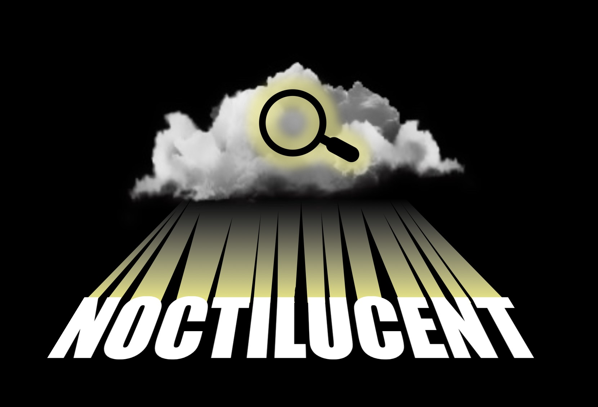
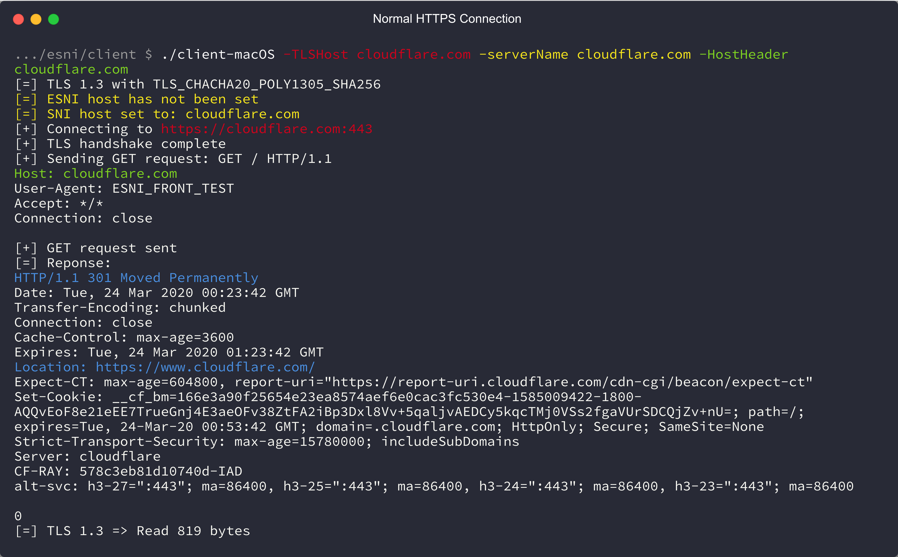
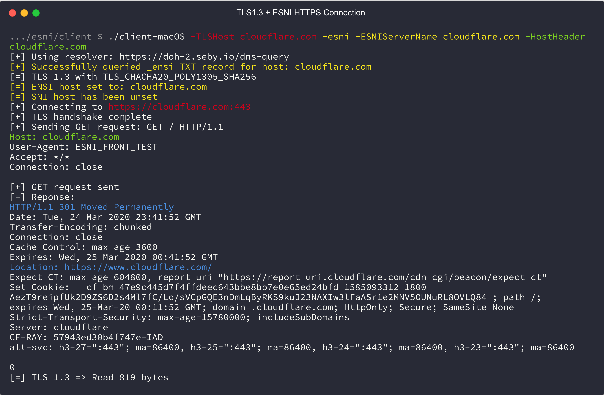
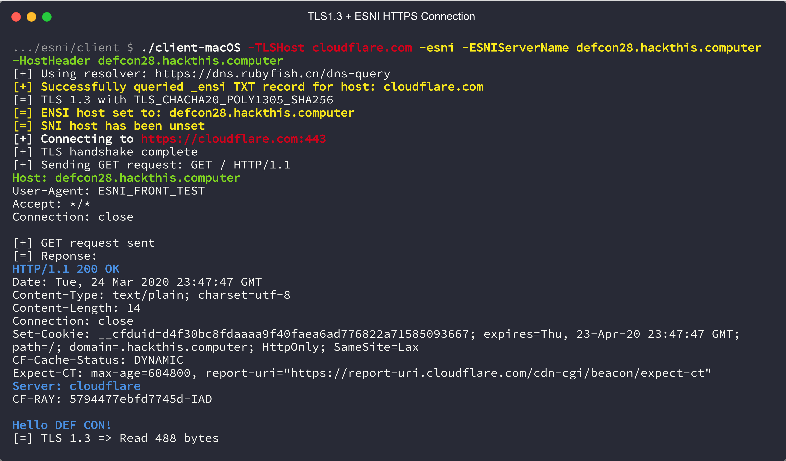
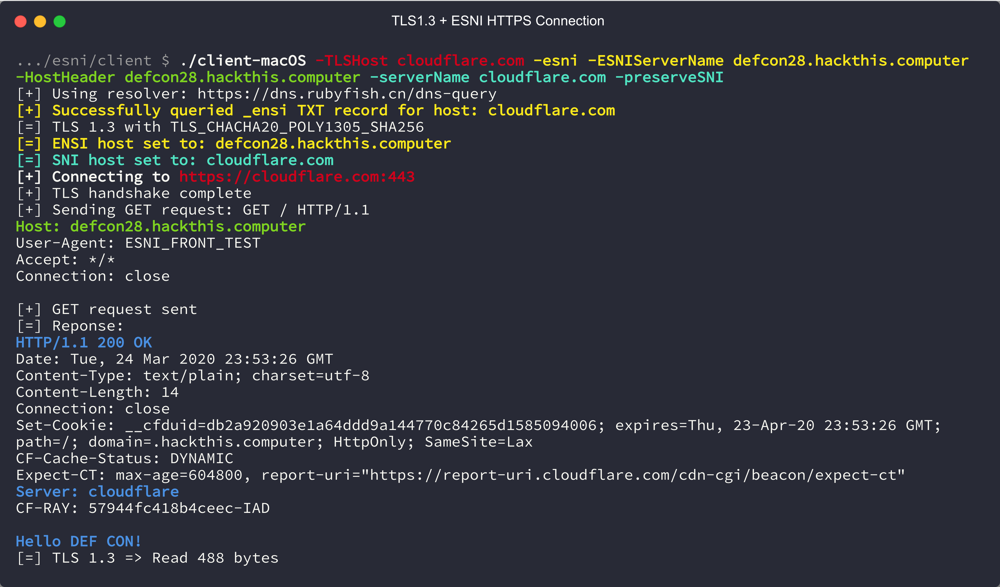
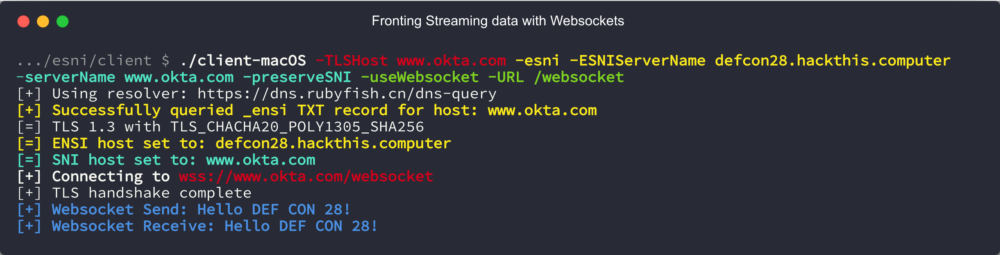

## Update 2020-08-10 - It was fun while it lasted

Cloudflare is now refusing any ClientHello with an ESNI and an SNI, effectively breaking Noctilucent's firewall bypass ability. You can still "hide" a connection by using any Cloudflare DNS hosted domain to connect to while sending your domain in the ESNI, but you can no longer set the unencrypted SNI value to arbitrary domains. 

Works:

```
$ ./noctilucent-client-macOS -TLSHost www.bitdefender.com -esni -ESNIServerName defcon28.hackthis.computer -HostHeader defcon28.hackthis.computer -serverName www.bitdefender.com
[+] Using resolver: https://mozilla.cloudflare-dns.com/dns-query
[+] Successfully queried _esni TXT record for host: www.bitdefender.com
[=] TLS 1.3 with TLS_CHACHA20_POLY1305_SHA256
[=] ESNI host set to: defcon28.hackthis.computer
[=] SNI host has been unset
[+] Connecting to https://www.bitdefender.com:443
[+] TLS handshake complete
[+] Sending GET request: GET / HTTP/1.1
Host: defcon28.hackthis.computer
User-Agent: ESNI_FRONT_TEST
Accept: */*
Connection: close


[+] GET request sent
[=] Reponse:
HTTP/1.1 200 OK
Date: Mon, 10 Aug 2020 17:51:07 GMT
Content-Type: text/plain; charset=utf-8
Content-Length: 14
Connection: close
Set-Cookie: __cfduid=dae00e2fadc81b286b86cce8f9db26c6d1597081866; expires=Wed, 09-Sep-20 17:51:06 GMT; path=/; domain=.hackthis.computer; HttpOnly; SameSite=Lax
CF-Cache-Status: DYNAMIC
cf-request-id: 047b186aa20000fd8613ae4200000001
Expect-CT: max-age=604800, report-uri="https://report-uri.cloudflare.com/cdn-cgi/beacon/expect-ct"
Server: cloudflare
CF-RAY: 5c0b90243993fd86-ORD

Hello DEF CON!
[=] TLS 1.3 => Read 537 bytes
```

No longer works:

```
$ ./noctilucent-client-macOS -TLSHost www.bitdefender.com -esni -ESNIServerName defcon28.hackthis.computer -HostHeader defcon28.hackthis.computer -serverName www.bitdefender.com -preserveSNI
[+] Using resolver: https://doh-fi.blahdns.com/dns-query
[+] Successfully queried _esni TXT record for host: www.bitdefender.com
[=] TLS 1.3 with TLS_CHACHA20_POLY1305_SHA256
[=] ESNI host set to: defcon28.hackthis.computer
[=] SNI host set to: www.bitdefender.com
[+] Connecting to https://www.bitdefender.com:443
[E] handshake failed: remote error: tls: protocol version not supported
```

For a similar tool that only does ESNI and has a built in SOCK5 proxy (and has cleaner code), check out [relaybaton](https://github.com/iyouport-org/relaybaton).

## Description

This is the code developed and presented as part of the DEF CON 28 (Safe Mode) talk "Domain Fronting is Dead, Long Live Domain Fronting: Using TLS 1.3 to evade censors, bypass network defenses, and blend in with the noise."

Domain fronting, the technique of circumventing internet censorship and monitoring by obfuscating the domain of an HTTPS connection was killed by major cloud providers in April of 2018. However, with the arrival of TLS 1.3, new technologies enable a new kind of domain fronting. This time, network monitoring and internet censorship tools are able to be fooled on multiple levels. This talk will give an overview of what domain fronting is, how it used to work, how TLS 1.3 enables a new form of domain fronting, and what it looks like to network monitoring. You can circumvent censorship and monitoring today without modifying your tools using an open source TCP and UDP transport tool (Cloak) that will be released alongside this talk.

Talk: [Youtube](https://youtu.be/TDg092qe50g)

Slides are available in the `docs` folder.

Compiled test client, test server, and Cloak client binaries are available under "Releases."

## Demos

Noctilucent test client bypassing Palo Alto 10.0 TLS decryption: [Youtube](https://youtu.be/TDg092qe50g?t=1002)

Noctilucent Cloak client: [Youtube](https://youtu.be/TDg092qe50g?t=1192)

Noctilucent Cloak client with CobaltStrike: [Youtube](https://youtu.be/TDg092qe50g?t=1322)

Noctilucent built into DeimosC2 Agent: [Youtube](https://youtu.be/TDg092qe50g?t=1417)

## Layout

```
Noctilucent
├── Cloak # The Cloak fork
│   ├── build # Compiled Cloak binaries 
│   ├── cmd # Cloak client and server source code
│   ├── example_config # Configs for Cloak and Shadowsocks
│   └── internal # Code for Cloak client and server
├── DeimosC2 # Modified HTTPS agent source code
├── _dev
│   └── GOROOT # Modified Go source tree (tls is placed in here)
├── client # Test client source code
│   └── build # Test client binaries
├── docs # Slides and other docs
│   ├── example-traffic.pcapng # 2 requests made with the Noctilucent test client
│   └── screenshots
├── findfronts # Helper to find domains that can be used with Noctilucent
├── server # Test server (HTTP and websockets)
├── tls # Noctilucent tls library (copied to _dev/GOROOT)
└── websocket # Noctilucent websocket library
```

## Use in Go projects

### HTTPS

1. Replace the `crpto/tls` import with `github.com/SixGenInc/Noctilucent/tls`.
2. Copy `esni_DoH.go` from `client` into your project (or use your own method for getting the keys).
3. Aquire and parse the ESNI Keys for Cloudflare:

```
esniKeysBytes, err := QueryESNIKeysForHostDoH("cloudflare.com", true)
if err != nil {
	fmt.Println("[E] Failed to retrieve ESNI keys for host via DoH: %s", err)
}
esnikeys, err := tls.ParseESNIKeys(esniKeysBytes)
if err != nil {
	fmt.Println("[E] Failed to parse ESNI keys: %s", err)
}
```

4. Set your `tls.Config` with the new options:

```
tlsConfig := &tls.Config{
	InsecureSkipVerify: true,
	ClientESNIKeys:     esnikeys,
	MinVersion:         tls.VersionTLS13, // Force TLS 1.3
	MaxVersion:         tls.VersionTLS13,
	ESNIServerName:     actualDomain,
	PreserveSNI:        true,
	ServerName:         frontDomain
}
```

5. Dial using this `tls.Config`

```
httpClient = &http.Client{
	Transport: &http.Transport{
		DialTLS: func(network, addr string) (net.Conn, error) {
			conn, err = tls.Dial("tcp", host+":"+port, tlsConfig)
			return conn, err
		},
	},
}
```

6. Make hidden requests!

```
r, err := httpClient.Post(("https://" + actualDomain + ":" + port + URL), "application/json", bytes.NewBuffer(someJSON))
```

### Websockets

Websockets are a bit different depending on which websocket library you are using. 

If you are currently using `golang.org/x/net/websocket`:

1. Replace it with `github.com/SixGenInc/Noctilucent/websocket`.
2. Aquire ESNI keys, parse, and setup a `tls.Config` like HTTPS.
3. Setup and Dial with the websocket library as so:

```
config, _ := websocket.NewConfigWithHost("wss://"+frontDomain+URL, "https://"+frontDomain, ESNIServerName)
config.TlsConfig = tlsConfig
ws, err := websocket.DialConfig(config)
```

4. Send and recieve using `ws` as normal, now hidden!

If you are currently using `github.com/gorilla/websocket`:

1. Aquire ESNI keys, parse, and setup a `tls.Config` like HTTPS.
2. Dial using the TLS config:

```
con, err := tls.Dial("tcp", fontDomainAndPort, tlsConfig)
```

3. Setup and force the `Host` header and use the TLS connection with the new websocket client:

```
header := http.Header{}
header.Add("Host", ESNIServerName)
u, _ := url.Parse("ws://" + fontDomainAndPort)
c, _, err := websocket.NewClient(con, u, header, 16480, 16480)
```

4. Use the websocket client as normal, now hidden!

## Build from source

### Setup - Ubuntu 18.04
Install latest go from [golang.org](https://golang.org/dl/)

Note: Developed with Go 1.14

```
sudo apt install make git gcc
make client # this will take a minute, we are replacing tls in the standard library and recompiling it
make cloak
```
### Setup - macOS 10.15

Install latest go from [golang.org](https://golang.org/dl/)

Note: Developed with Go 1.14

```
xcode-select --install
make client # this will take a minute, we are replacing tls in the standard library and recompiling it
make cloak
```
Client binaries are available in `client/build` and Cloak client binaries are available in `Cloak/build`.

The modifications made to Cloak can be seen in `Cloak/git_diff.patch`

## Testing

### Test Client

The `server/server.go` contains a sample HTTP and websocket server to test against.
You can build the server and run it on your own VPS with `go build` inside the server directory.
Setup a Cloudflare account and point a domain at your VPS. Ensure that SSL/TLS is set to "Flexible"
as the server is not using TLS (or setup a reverse-proxy to handle TLS). Run the server binary (as root, it binds to port 80) on the VPS and 
replace `defcon28.hackthis.computer` in the examples with your domain. You can replace `-serverName` 
with anything (really, even non-domain strings) and `-TLSHost`
with any site that is hosted behind Cloudflare (lots, try medium.com).
Cloudflare has a helpful site for finding frontable domains [here](https://www.cloudflare.com/case-studies/), or you can choose any from `findfronts/frontable100k.txt`.

#### TLS 1.3



#### TLS 1.3 with ESNI (ECH)



#### TLS 1.3 with ESNI (ECH) and Hiding



#### TLS 1.3 with ESNI (ECH), Hiding, and decoy SNI



#### TLS 1.3 with ESNI (ECH), Hiding, and decoy SNI - Websocket



### Cloak Client

1. Setup a standard Cloak + Shadowsocks server using [this script](https://github.com/HirbodBehnam/Shadowsocks-Cloak-Installer/blob/master/Cloak2-Installer.sh).
2. Download a [shadowsocks-rust binary](https://github.com/shadowsocks/shadowsocks-rust/releases) for your platform.
3. Use the `noctilucent-cloak-client` and `sslocal` to create a local SOCKS proxy that is hidden behind a Cloudflare hosted domain. Example configs are available in `Cloak/example_config` and should be edited to match the values given by the Cloak + Shadowsocks setup script.


## Thanks

This project is based on cloudflare's [tls-tris](https://github.com/cloudflare/tls-tris) and inspired by [DigiNinja's](https://digi.ninja/blog/cloudflare_example.php) rough openssl PoC work. It also includes a modified version of ahhh's DNS over HTTPS code, [godns](https://github.com/ahhh/godns) and of course [Cloak](https://github.com/cbeuw/Cloak).
